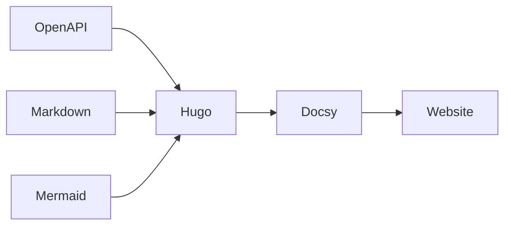

# RL Digital API Documentation

Zentrale Dokumentationsplattform für die APIs der RL-Digital-Landschaft.

## Ziele des PoC

Dieser Proof of Concept bewertet die Eignung von Hugo und Docsy für die Umsetzung von DIGIT-2604.

### Bewertete Funktionen

- OpenAPI-basierte API-Dokumentation
- Technische und fachliche Dokumentation aus einer Quelle
- Mermaid-Diagramme
- Versionierung und Release Notes
- Volltextsuche
- Automatisierte Bereitstellung
- Git-basierte Zusammenarbeit

## APIs

### eAAPI

Electronic Author API für die Pflege und Bereitstellung von Produktinformationen.

[Zur eAAPI-Dokumentation](/rl-digital-apiPI

Consumer API für die Abfrage von Produktinformationen.

[Zur ecAPI-Dokumentation](/rlpi/

### PAPI

Portal API für Portal- und Verwaltungsfunktionen.

[Zur PAPI-Dokumentation](/rl-digital-apiitektur

## PoC-Ergebnis

| Kriterium | Status |
|-----------|--------|
| Hugo Evaluation | ✅ |
| Docsy Evaluation | ✅ |
| OpenAPI Integration | ✅ |
| Mermaid Integration | ✅ |
| Versionskonzept | ✅ |
| Suchfunktion | ✅ |
| Zielhosting bewertet | ✅ |
| Zugriffsschutz bewertet | ✅ |

## Nächste Schritte

1. Fachliche Inhalte vervollständigen
2. Versionierte API-Dokumentation erweitern
3. Produktives Zielhosting auswählen
4. Governance und Freigabeprozess definieren