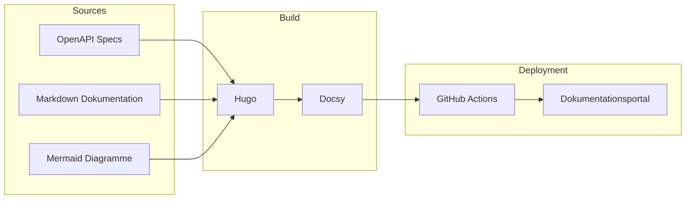

# RL Digital API Documentation

Evaluierung von Hugo + Docsy im Rahmen von DIGIT-2604 zur Neustrukturierung der internen und externen API-Dokumentation.

## Bewertete Funktionen

- OpenAPI-basierte API-Dokumentation
- Technische und fachliche Dokumentation aus einer Quelle
- Mermaid-Diagramme
- Versionierung und Release Notes
- Volltextsuche
- Automatisierte Bereitstellung
- Git-basierte Zusammenarbeit

## APIs

### eAAPI

👉 [Zur eAAPI](/rl-digital-api-docs/apis/eaapi/)

### eCAPI

👉 [Zur eCAPI](/rl-digital-api-docs/apis/ecapi/)

### PAPI

👉 [Zur PAPI](/rl-digital-api-docs/apis/papi)

## Architektur

## PoC-Ergebnis

| Kriterium | Status |
|-----------|---------|
| Hugo Evaluation | ✅ |
| Docsy Evaluation | ✅ |
| OpenAPI Integration | ✅ |
| Mermaid Integration | ✅ |
| Versionskonzept | ✅ |
| Suchfunktion | ✅ |
| Hosting | ✅ |
| CI/CD | ✅ |

## Nächste Schritte

1. Versionierung fertigstellen
2. OpenAPI-Automatisierung integrieren
3. GitHub Actions vervollständigen
4. Hosting-Konzept dokumentieren
5. Architekturentscheidung für DIGIT-2604 vorbereiten