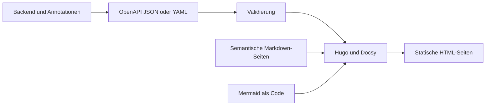

## Dokumentationspipeline

```mermaid
flowchart LR
  Code[Backend und Annotationen] --> Spec[OpenAPI JSON oder YAML]
  Spec --> Validation[Validierung]
  Validation --> Hugo[Hugo und Docsy]
  Markdown[Semantische Markdown-Seiten] --> Hugo
  Mermaid[Mermaid als Code] --> Hugo
  Hugo --> Site[Statische HTML-Seiten]
```

Die Darstellung beschreibt die Vorlage. Projektspezifische Erzeugungswege sind separat zu verifizieren.
