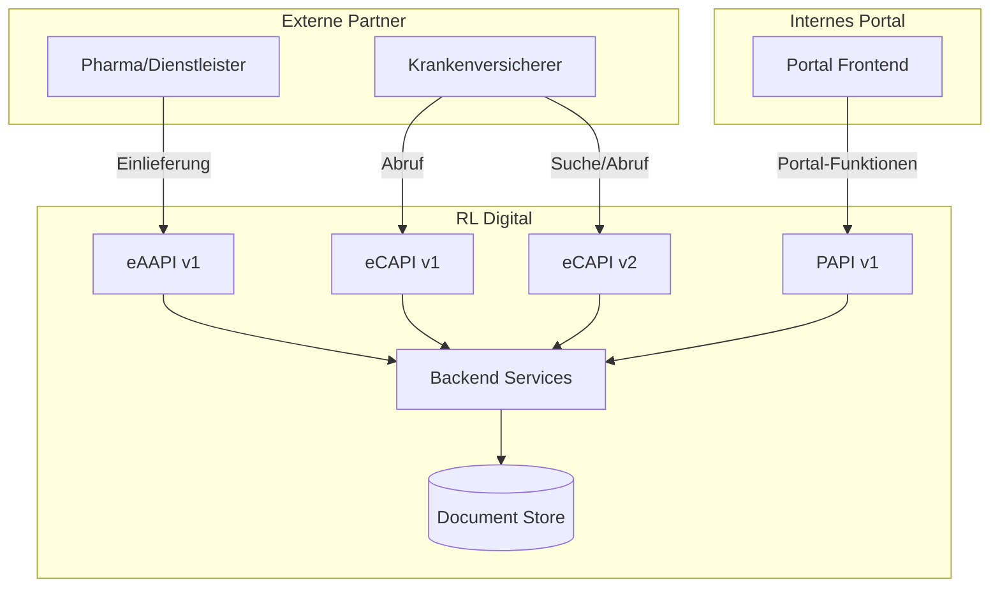
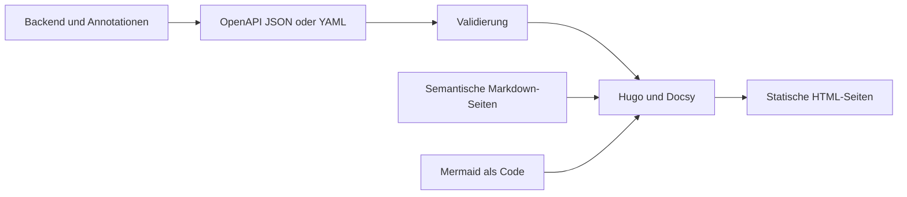

## API- und Dokumentationsarchitektur

```mermaid
flowchart TB

    subgraph EX["Externe Partner"]
        PD["Pharma/Dienstleister"]
        KV["Krankenversicherer"]
    end

    subgraph IP["Internes Portal"]
        PF["Portal Frontend"]
    end

    subgraph RL["RL Digital"]
        EA["eAAPI v1"]
        EC1["eCAPI v1"]
        EC2["eCAPI v2"]
        PA["PAPI v1"]

        BS["Backend Services"]

        DS[("Document Store")]
    end

    PD -->|Einlieferung| EA

    KV -->|Abruf| EC1
    KV -->|Suche/Abruf| EC2

    PF -->|Portal-Funktionen| PA

    EA --> BS
    EC1 --> BS
    EC2 --> BS
    PA --> BS

    BS --> DS
```

## Dokumentationspipeline

```mermaid
flowchart LR
  Code[Backend und Annotationen] --> Spec[OpenAPI JSON oder YAML]
  Spec --> Validation[Validierung]
  Validation --> Hugo[Hugo und Docsy]
  Markdown[Semantische Markdown-Seiten] --> Hugo
  Mermaid[Mermaid als Code] --> Hugo
  Hugo --> Site[Statische HTML-Seiten]
```

Die Darstellung beschreibt die Vorlage. Projektspezifische Erzeugungswege sind separat zu verifizieren.
