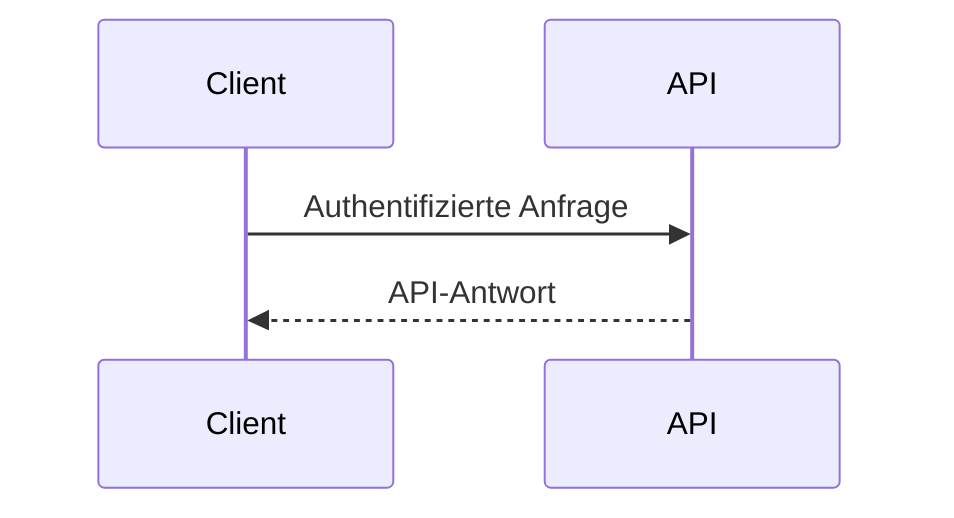

## Beispielablauf

```mermaid
sequenceDiagram
  participant C as Client
  participant A as API
  C->>A: Authentifizierte Anfrage
  A-->>C: API-Antwort
```

Das Diagramm ist ein technischer Platzhalter und beschreibt keinen freigegebenen Produktivablauf.
